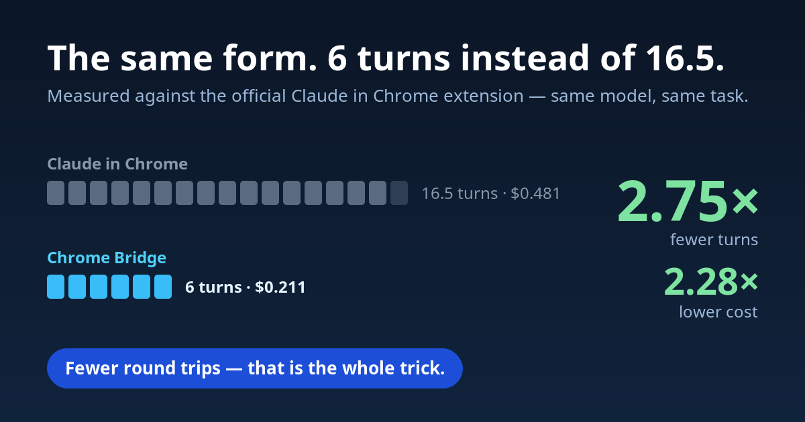
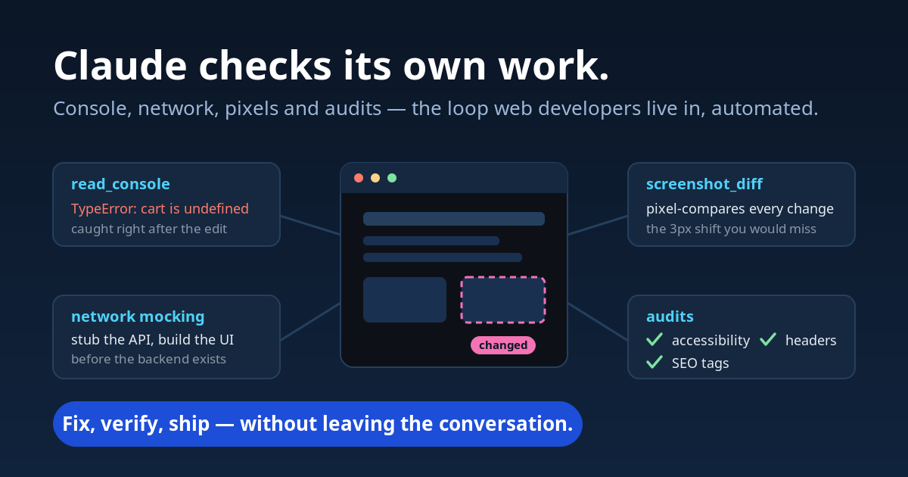
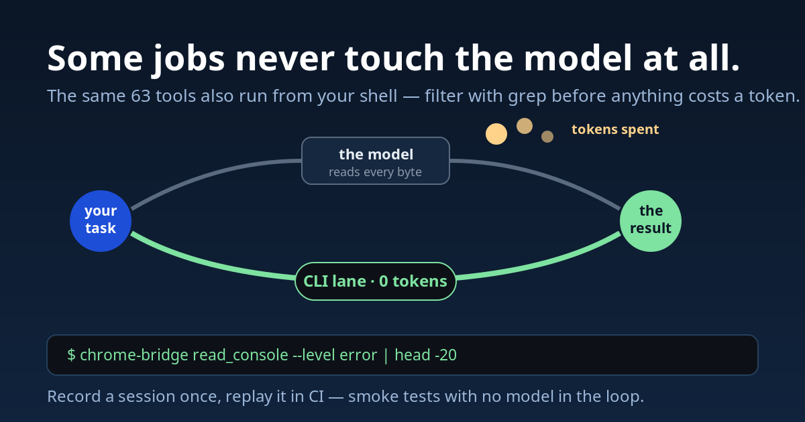
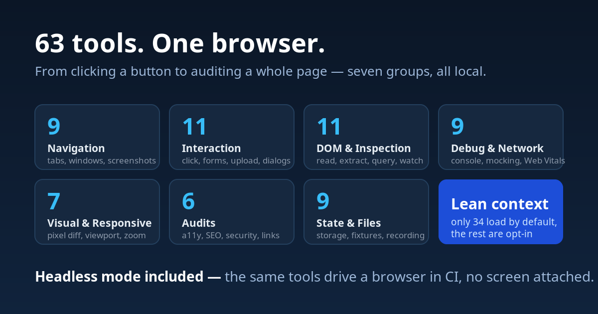
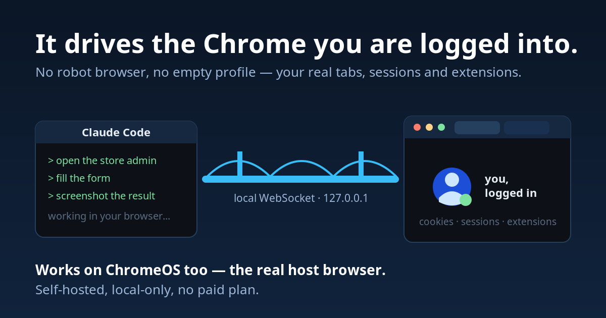

# Chrome Bridge

    [](https://chromewebstore.google.com/detail/chrome-bridge-for-claude/bioknpaeahidbelaljjohjofiloeodmb)

**An MCP server that gives Claude Code your real, logged-in Chrome — measured
2.75× fewer turns and 2.28× lower cost than the official "Claude in Chrome"
extension on a form-filling task, with ~3× the toolset and no paid plan.**

59 web-development tools (navigation, DOM inspection, visual regression, audits,
network mocking) over a local WebSocket bridge, plus a headless instance for CI.
Self-hosted, local-only.



## Quickstart

**Requires** Node.js 18+ and Chrome 135+.

```bash
git clone git@github.com:frsorrentino/chrome-bridge.git
cd chrome-bridge && ./install.sh
```

1. Open `chrome://extensions`, enable **Developer mode**, click **Load
   unpacked**, select the `extension/` folder.
2. Restart Claude Code.

Then ask for something like *"open localhost:3000, run an accessibility audit
and find the Sign Up button"*: Claude Code calls `navigate`,
`audit` and `find_text`. Because `navigate` already returns
element refs, `click(ref="n1")` follows with no discovery turn in between.

> **On ChromeOS/Crostini** install from the [Chrome Web
> Store](https://chromewebstore.google.com/detail/chrome-bridge-for-claude/bioknpaeahidbelaljjohjofiloeodmb)
> instead: an unpacked extension is dropped on every reboot, because the
> container isn't mounted when Chrome starts.

`install.sh` registers the MCP server with `--scope user`. To do it by hand:
`claude mcp add --scope user chrome-bridge node /path/to/server/index.js`.
For `execute_js`, enable **Allow user scripts** in `chrome://extensions` →
Chrome Bridge → Details (on Chrome 135-137, enable Developer Mode instead).

**As a plugin, without a clone:** in Claude Code, `/plugin marketplace add
frsorrentino/chrome-bridge` then `/plugin install chrome-bridge@chrome-bridge`
registers the MCP server from npm (all capabilities) together with the recipes
skill; clients that read [Agent Plugins 1.0](https://agent-plugins.org) get the
same from `plugin.json` + `mcp.json`. The extension still comes from the Web
Store or `extension/`. Pick one path: the plugin and `install.sh` would
register the same server twice.

## Why Chrome Bridge?

| | Chrome Bridge | Claude in Chrome | Chrome DevTools MCP | Playwright MCP |
|---|---|---|---|---|
| **ChromeOS / Crostini** | **Yes** (real host) | No | Container only | Container only |
| **Tools** | **59** (38 core) | 22 | 29 default (56 with flags) | 24 core (71 total) |
| **Requires paid plan** | **No** | Yes (Pro+) | No | No |
| **Network mocking** | **Yes** (stub/headers) | No | No | Yes |
| **Visual regression** | **Yes** (`screenshot_diff`) | No | No | No |
| **Audits (a11y/SEO/sec)** | **Yes** (one call, report on disk) | No | Lighthouse | No |
| **Headless / CI** | **Yes** | No | Yes | Yes |
| **GIF / video** | No | **Yes** | Partial | No |
| **Breakpoints / heap** | No | No | **Yes** | No |

Codex for Chrome (OpenAI, May 2026) sits in the Claude in Chrome column: an
official extension with the `debugger` permission, macOS and Windows only,
the ChatGPT app required. Claude in Chrome documents Linux desktop since
September 2026; ChromeOS and WSL stay out. Competitor figures measured on
2026-09-01 and 2026-09-11 (`docs/analisi-2026-09-11-concorrenti.md`).

It wins on **round trips, not payload size**: short element refs instead of the
screenshot-and-click loop, `fill_form` filling N fields in one call, table
filtering done server-side. Per single turn it actually costs slightly *more*.

The full benchmark — method, every raw run including the unfavourable ones, and
what the harness can't measure — is in
[docs/EFFICIENCY.md](docs/EFFICIENCY.md).



## Using it

The **skill** in [`skills/chrome-bridge/SKILL.md`](skills/chrome-bridge/SKILL.md)
is what makes the tools discoverable: recipes with the phrase that triggers
each one ("verify the email arrives", "test the checkout with a test card",
"which plugin slows the page", "what fires before consent"), the tool sequence,
and the zero-token CLI commands the model would otherwise never see.
`install.sh` copies it to `~/.claude/skills/chrome-bridge`; do the same by
hand for other clients.

Beyond the MCP tools, two lanes keep work away from the model entirely.



**CLI** — batch operations, piped through `grep` or `jq` before anything reaches
the context:

```bash
chrome-bridge navigate --url https://example.com
chrome-bridge read_console --level error | head -20
chrome-bridge assert --selector "#success" --text "Done"
chrome-bridge replay --file ./recordings/login.jsonl
```

**Launch mode** — a dedicated Chromium instance with an ephemeral profile, for
isolated sessions or CI:

```bash
node server/index.js --launch --headless
```

Pair it with `session_record` + `replay` for smoke tests with no model in the
loop. In launch mode `execute_js` falls back to `new Function` when the
user-script toggle isn't available.

## Tools

59 in total, in seven groups. Only `core` (38 tools) loads by default; the rest
are opt-in via `--caps`.



| Group | N | What's in it |
|---|---|---|
| Core & Navigation | 13 | tabs, windows, `navigate`, `screenshot`, `tile_windows` |
| Interaction | 11 | `click`, `fill_form`, `upload_file`, dialogs, clipboard |
| DOM & Inspection | 10 | `read_page`, `extract`, `query_dom`, `watch_dom` |
| Debugging & Network | 8 | `execute_js`, console, network log, mocking, `track_events` |
| Visual & Responsive | 5 | `screenshot_diff`, viewport and zoom, media emulation |
| Audits | 2 | `audit` (a11y, keyboard, SEO, security, links, vitals, css, resources, cache in one call), `cookie_audit` |
| State, Storage & Files | 9 | storage, fixtures, MHTML, recording, `assert` |

Every tool, with the notes that matter: [docs/TOOLS.md](docs/TOOLS.md).

## How it works



```
Claude Code  <--stdio-->  MCP Server  <--WebSocket :8765-->  Chrome Extension
                          (server/)                          (extension/, MV3)
```

The Node.js server handles the protocol and tool logic; the MV3 extension
executes commands through Chrome APIs. User scripts (`execute_js`) run via
`chrome.userScripts.execute()`.

## Configuration and security

Environment variables, each with a matching CLI flag:

| Variable | Default | Notes |
|---|---|---|
| `CHROME_BRIDGE_PORT` | `8765` | |
| `CHROME_BRIDGE_HOST` / `--host` | `127.0.0.1` | `0.0.0.0` **only** where the browser lives outside the container (ChromeOS/Crostini port-forward) — and only with a token |
| `CHROME_BRIDGE_TOKEN` | unset | Required on both `ext_init` and `relay_init`. Strongly recommended whenever the bind isn't loopback |
| `CHROME_BRIDGE_CAPS` / `--caps` | `core` | `core`, `audits`, `visual`, `network`, `storage`, `dom`, `files`, `all`. `install.sh` uses `all` |
| `CHROME_BRIDGE_NO_JS` / `--no-js` | unset | No arbitrary JavaScript in the page: `execute_js` and `modify_dom` leave the schema, `wait_for(condition=function)` and `javascript:`/`data:` URLs are refused. `get_status` reports `js_evaluation` |
| `CHROME_BRIDGE_WRITE_ROOT` / `--write-root` | unset | Every path the model chooses (`save_to`, `output_path`, exports) must be under this directory, checked before the browser does any work; the server's own state under `~/.config/chrome-bridge` stays writable. The CLI is your shell and is not restricted |

The bridge binds loopback, accepts extension connections only from a
`chrome-extension://` origin, and — when a token is set — requires it on both
handshakes. Without one, any local process could act as a relay and reach
`execute_js` inside your authenticated browser session. Secondary MCP instances
connect via loopback and are acknowledged with `relay_init_ok`, so a foreign
process holding the port fails fast instead of timing out per command.

**What is *not* protected:** page content reaches the model unfiltered, so a
hostile page's text is untrusted input. `get_storage`, `session_fixture`, HAR
exports and screenshots are **not** redacted and may carry cookies, tokens or
personal data. Don't point the automation at pages holding secrets you wouldn't
paste into a chat.

## Troubleshooting

| Symptom | Cause / fix |
|---|---|
| `Chrome extension not connected` | Extension disabled, or its port differs from the server's. The error names the actual host/port; check them in the popup (⚙). |
| Port 8765 already in use | Expected: a second MCP session becomes a **relay** and shares the one bridge. Set `CHROME_BRIDGE_PORT` for a separate one. |
| `Port N is held by a process that is not chrome-bridge` | Something else owns the port. Free it or change `CHROME_BRIDGE_PORT`. |
| `execute_js` fails | Enable **Allow user scripts** in `chrome://extensions` → Chrome Bridge → Details (Chrome 138+; on 135-137 enable Developer Mode). |
| `read_console` returns `note=Instrumentation not loaded` | The page was opened before the extension, "Capture console & metrics" is off, or the page isn't injectable (`chrome://`). Reload it. |
| Screenshot times out, or `image readback failed` | A minimized or fully covered window stops producing frames; captures fail after 10 s. Bring the window forward. |
| `wait_for`/`scroll` return `page_hidden: true`, pages stop updating | Same cause: Chrome does not render a hidden page and slows its timers (after a few minutes, to one wake-up per minute). `get_page_info` reports `visibility`. Bring the window on screen, or `create_tab` with `new_window` and bounds. |
| `screenshot presets` says `NOT APPLIED` | Presets resize the window; they do not emulate a phone (no device pixel ratio, UA or touch). The window manager enforces a minimum width, and no window exceeds the screen (e.g. at most a 1536×686 viewport on a 1536×864 ChromeOS screen). For phone emulation or larger viewports use a headless browser. |
| `type_text` returns `mismatch: true` | The field rejected the value. Events from an extension have `isTrusted: false`, and some widgets (date pickers, search boxes with tokenizers) discard them. Try `mode: 'keys'`, then the site's own controls (the calendar buttons), or `handoff`. |
| `[media removed: request limit]` instead of a screenshot | Written by the MCP client, not by the bridge: too many images in one request. Use `save_to`, or `element_screenshot` with `region` and a small `scale`. |
| Commands work, then stop | The MV3 service worker restarted and in-memory state (network log, diff baselines, HTTP auth) was reset. Re-run the monitoring call. |
| Extension dropped on every ChromeOS reboot | Install from the Web Store instead of Load unpacked. |
| Tool missing from the list | It's in an opt-in group. Check `get_status` → `caps_available`, then set `CHROME_BRIDGE_CAPS=all`. |

## Documentation

- [docs/TOOLS.md](docs/TOOLS.md) — all 59 tools, by group
- [docs/CAPABILITIES.md](docs/CAPABILITIES.md) — what the bridge gets past and what it does not, one dated state per wall
- [docs/EFFICIENCY.md](docs/EFFICIENCY.md) — the benchmark and the design behind it
- [docs/PERFORMANCE.md](docs/PERFORMANCE.md) — latency per tool on the real path, `npm run bench:latency`
- [bench/RESULTS.md](bench/RESULTS.md) — raw runs and inclusion rule
- [CHANGELOG.md](CHANGELOG.md)

## Tests

`npm test` (Chrome-free, ~22s) · `npm run test:e2e` (needs Chrome and a
connected extension; with a bridge already on 8765:
`CHROME_BRIDGE_PORT=8799 node test/test-devtools.js --launch`, which opens
its own Chromium with `extension/`) · `npm run measure` (schema cost) ·
`npm run bench:latency` (milliseconds per tool, launches its own Chromium,
writes `docs/PERFORMANCE.md`).

## License

MIT
